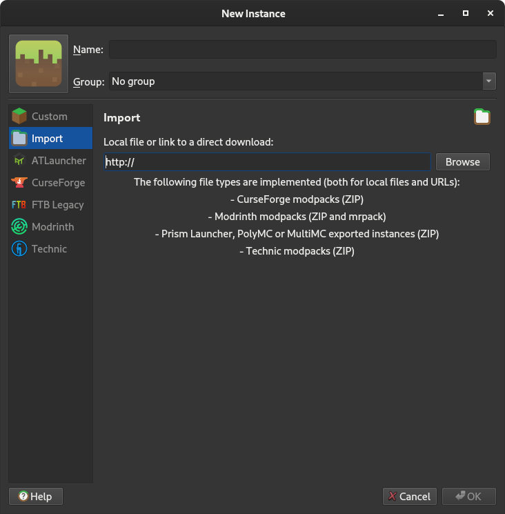

# christmas modpack 2023

minecraft server configuration for my 2023 christmas modpack

## usage (client)

1. Download Adoptium.

| Operating System | Download Link |
| :--------------: | :------------ |
| Windows          | <https://adoptium.net/temurin/releases/?package=jre&os=windows&arch=x64> Use the `.msi` installer. |
| macOS (Apple Silicon) | <https://adoptium.net/temurin/releases/?package=jre&os=mac&arch=aarch64> Use the `.pkg` installer. |
| macOS (Intel)    | <https://adoptium.net/temurin/releases/?package=jre&os=mac&arch=x64> Use the `.pkg` installer. |
| Linux            | Use your system package manager to install Java 17 JRE or JDK. Any distribution should work, but I like OpenJDK |

2. Download Prism Launcher from <https://prismlauncher.org>. Make sure you get the installer, not the portable.
3. Run Prism Launcher. During the installation, select the JRE you installed in step one, when it prompts you to select a Java version.
4. Click "Add Instance" and then "Import". It should look like this:

5. Paste this link into the blank space: <https://github.com/ryleu/christmas-modpack-2023/releases/download/auto-update/christmas_modpack_2023.zip>
6. Press "OK".

You're done! Double click the instance to run it. The first time you run it, it'll automatically download all of the mods in the pack.
It will also prompt you to add an account, so make sure you log in with the Microsoft account associated with your Minecraft profile.

## usage (server)

1. install docker
2. clone the repo
3. run `docker compose up -d`
