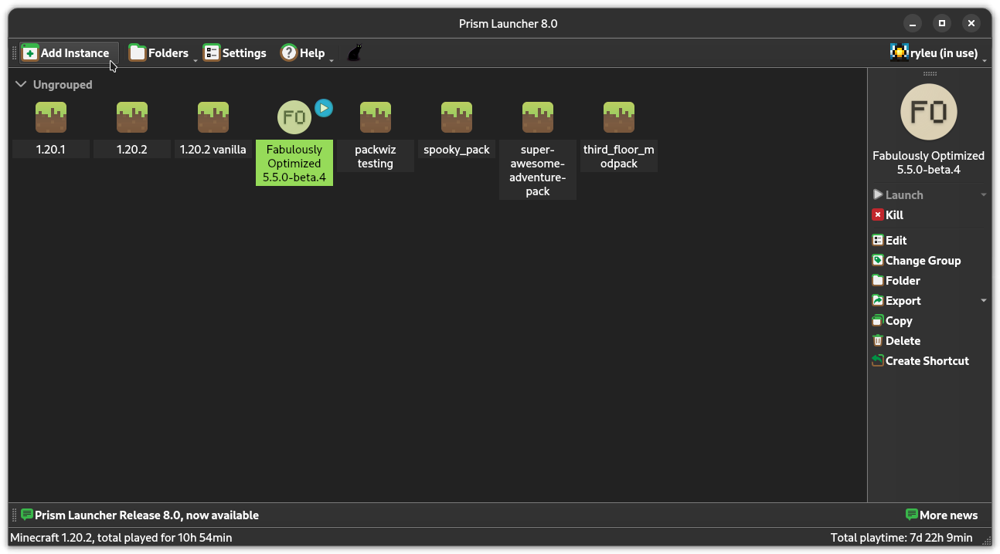
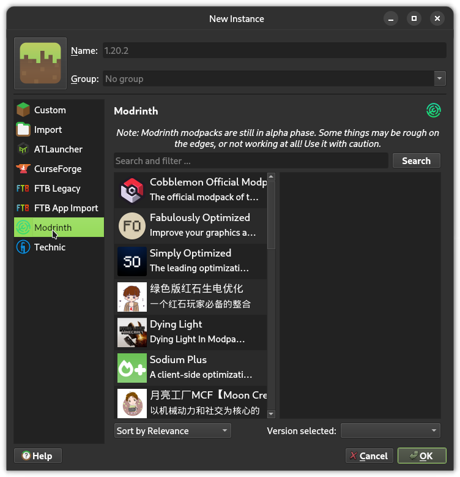
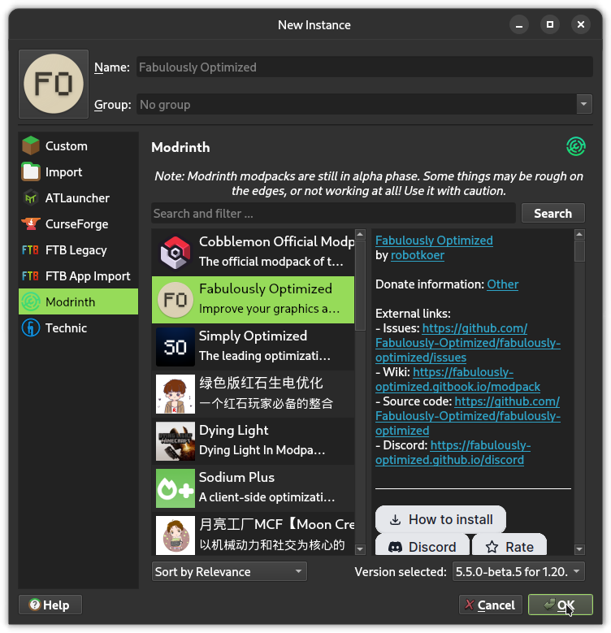

# Performance Enhancement Guide

Howdy! If you're here, I probably linked this to you because you're experiencing performance issues or overheating. If that's the case, you're in the right place!

To start, let's set up your modding environment by using [this handy guide right here.](./modding.md) Once you've done that we have one more step to get you ready to go with buttery smooth gameplay & optionally [shaders.](./shaders.md)

1. Launch Prism Launcher

2. Click add instance:

3. Click Modrinth:

4. Select Fabulously Optimized & click OK:

5. After it's installed, double click the Fabulously Optimized instance to launch the game!